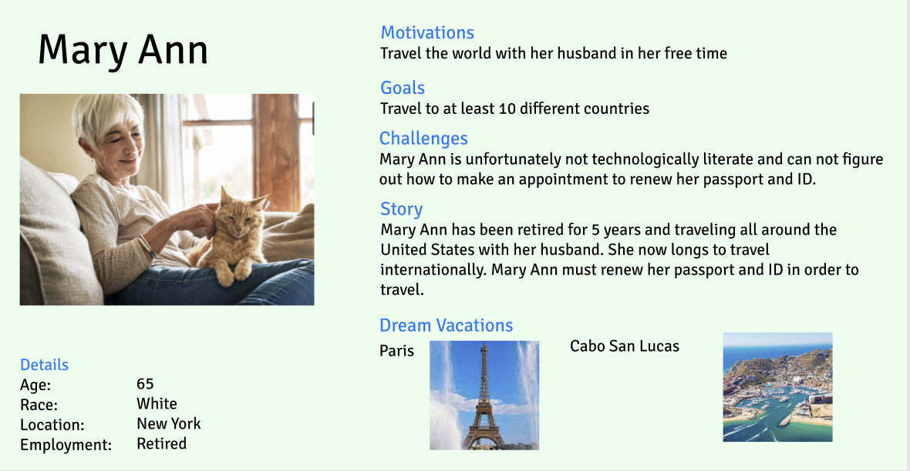
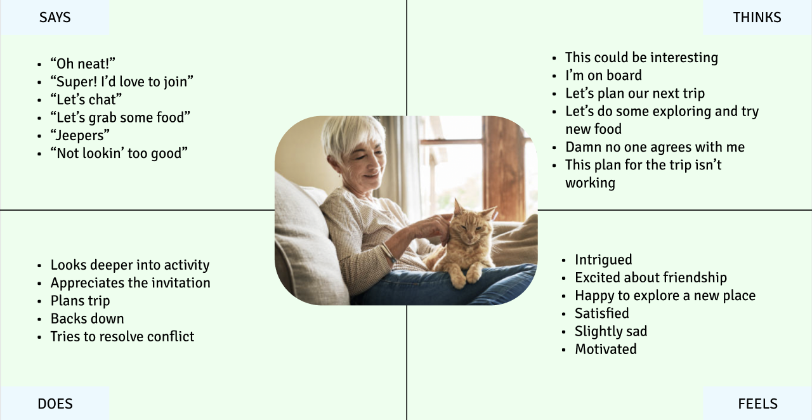
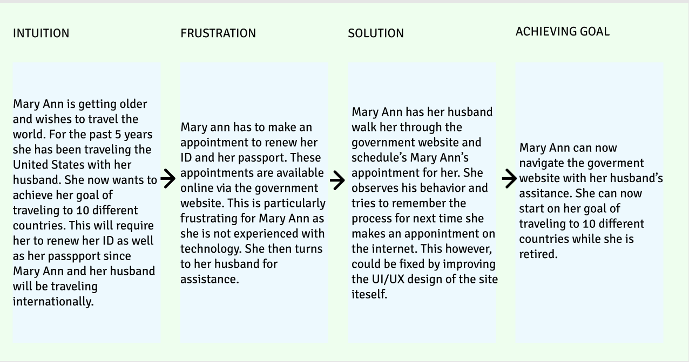

# Persona and Scenario
## Purpose of UX Storytelling in my Project
> Since my project deals with government websites, it is very important for me to put myself in different users' shoes. By doing so I will create a siet that focuses on my users' behavior by looking attheir beahavior, their story, and their pain points.
## Persona and Empathy Maps
### Person 1: Mary Ann Smith
#### Persona

#### Empathy Map

#### MAry Ann's Journey Map for Renewing her ID and Passport

