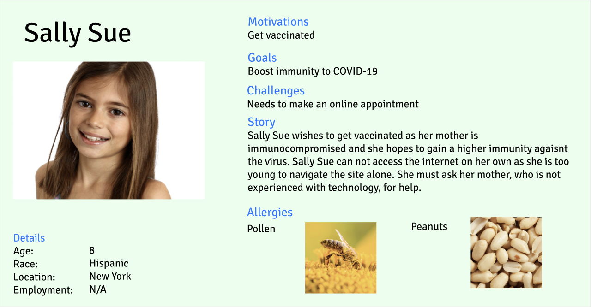
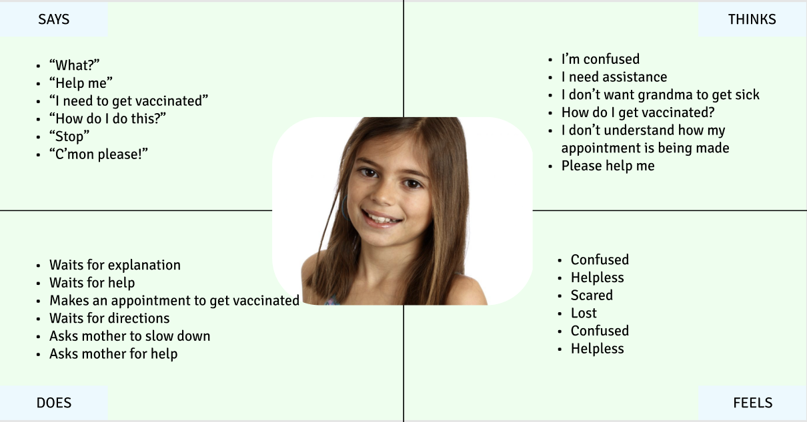
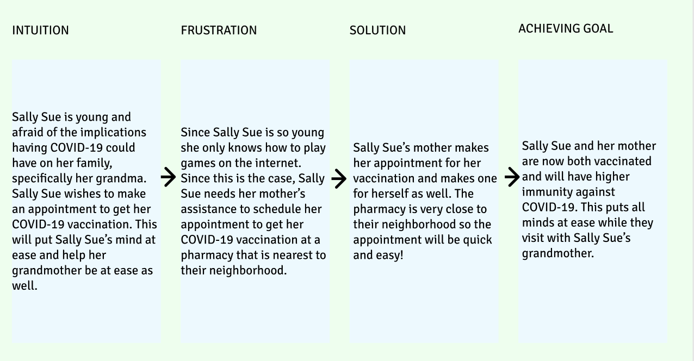

# Persona and Scenario
## Purpose of UX Storytelling in my Project
> Since my project deals with government websites, it is very important for me to put myself in different users' shoes. By doing so I will create a siet that focuses on my users' behavior by looking attheir beahavior, their story, and their pain points.
## Persona and Empathy Maps
## Person 1: Mary Ann
#### Persona

#### Empathy Map

## Mary Ann's Journey Map for Renewing Her ID and Passport
> Scenario: Mary Ann must renew her ID and passport by making an online appointment
#### Why?
> Mary Ann is dying to go out of the country! The only issue is she must renew her ID and passport and needs these documents ASAP! Mary Ann knows that making an online apointment would be the easiest way for to get an apointment to renew the documents but she is not good with working a computer or mobile device.
#### How?
> Mary Ann then asks her husband to assist her so they can travel together soon! He quickly says yes and sits down at the computer with Mary Ann. They log on to the government website and click on "Make Account" so Mary Ann can store and save all her information in one place. Mary Ann's husband then walks her through the steps in an effort to help her learn technology.

## Person 2: Sally Sue
#### Persona

#### Empathy Map

## Sally Sue's Journey Map for Making Her Vaccination Appointment
> Scenario: Sally Sue must make an online appointment to get her COVID-19 vaccination
#### Why?
> Sally Sue's grandmother is immunocompromised so Sally Sue wishes to get vaccinated to protect not only herself but her grandmother as well. The only issue is that Sally Sue is too young to operate a computer by herself. She must ask her mother for assistance.
#### How?
> Sally Sue asks her mother for assistance in scheduling her appointment. Her mother has SAlly Sue watch as she makes the appointment by clicking the "Make Appointment" button on th screen.

